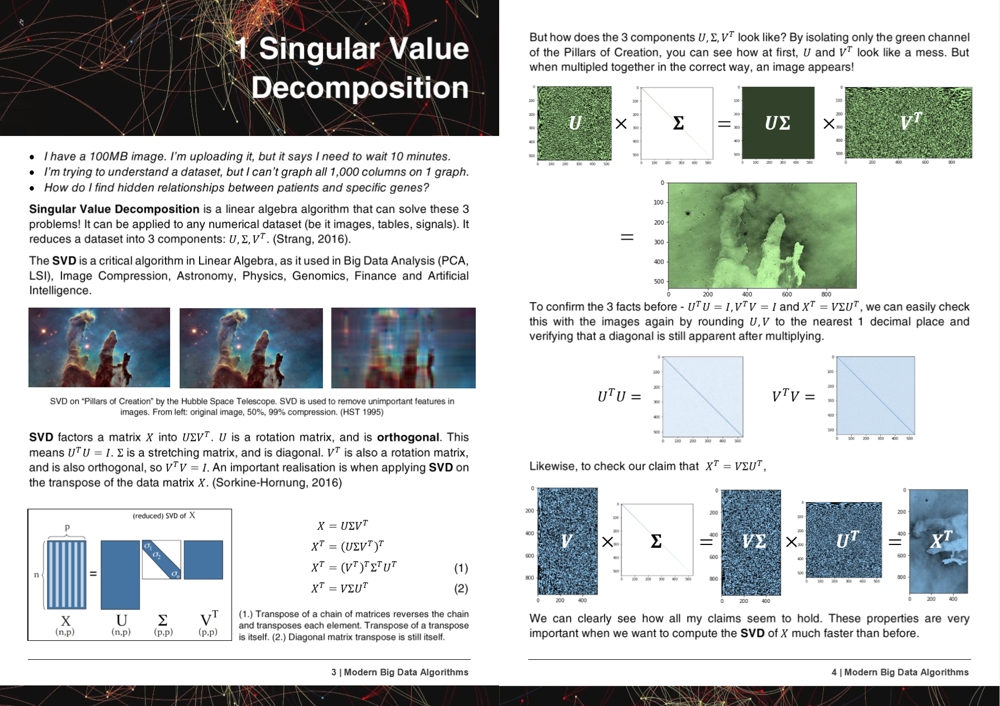

*[Due to the time taken @ uni, work + hell breaking loose in my life, since things have calmed down a bit, will continue commiting!!!]*
*[By the way, I'm still looking for new contributors! Please help make HyperLearn no1!!]*

*Regardless of where you are, Umbra allows you to solve humanity's most pressing issues, including poverty, crime and climate change. By indexing public data with Artificial Intelligence, Umbra aims to create the world's first public simulation of Planet Earth.*

I'm recruiting for people who want to change the world! Do the quiz @ https://daniel3112.typeform.com/to/K84Qu0 :) I'll be waiting.

*HyperLearn is what drives Umbra's AI engines. It is open source to everyone, everywhere, and we hope humanity can rise to the stars.*

[Notice - I will be updating the package monthly or bi-weekly due to other commitments]

---

https://hyperlearn.readthedocs.io/en/latest/index.html

*Faster, Leaner GPU Sklearn, Statsmodels written in PyTorch*

**50%+ Faster, 50%+ less RAM usage, GPU support re-written Sklearn, Statsmodels combo with new novel algorithms.**

HyperLearn is written completely in PyTorch, NoGil Numba, Numpy, Pandas, Scipy & LAPACK, and mirrors (mostly) Scikit Learn.
HyperLearn also has statistical inference measures embedded, and can be called just like Scikit Learn's syntax (model.confidence_interval_) Ongoing documentation: https://hyperlearn.readthedocs.io/en/latest/index.html

I'm also writing a mini book! A sneak peak:

---

### Comparison of Speed / Memory

| Algorithm         |  n    |  p  | Time(s) |            | RAM(mb) |            | Notes                   |
| ----------------- | ----- | --- | ------- | ---------- | ------- | ---------- | ----------------------- |
|                   |       |     | Sklearn | Hyperlearn | Sklearn | Hyperlearn |                         |
| QDA (Quad Dis A)  |1000000| 100 |   54.2  |   *22.25*  |  2,700  |  *1,200*   | Now parallelized        |
| LinearRegression  |1000000| 100 |   5.81  |   *0.381*  |   700   |    *10*    | Guaranteed stable & fast|

Time(s) is Fit + Predict. RAM(mb) = max( RAM(Fit), RAM(Predict) )
 
I've also added some preliminary results for N = 5000, P = 6000

Since timings are not good, I have submitted 2 bug reports to Scipy + PyTorch:
1. EIGH very very slow --> suggesting an easy fix #9212 https://github.com/scipy/scipy/issues/9212
2. SVD very very slow and GELS gives nans, -inf #11174 https://github.com/pytorch/pytorch/issues/11174

---
#### Help is really needed! Message me!
---
# Key Methodologies and Aims
#### 1. [Embarrassingly Parallel For Loops](#1)
#### 2. [50%+ Faster, 50%+ Leaner](#2)
#### 3. [Why is Statsmodels sometimes unbearably slow?](#3)
#### 4. [Deep Learning Drop In Modules with PyTorch](#4)
#### 5. [20%+ Less Code, Cleaner Clearer Code](#5)
#### 6. [Accessing Old and Exciting New Algorithms](#6)
---

### 1. Embarrassingly Parallel For Loops
  * Including Memory Sharing, Memory Management
  * CUDA Parallelism through PyTorch & Numba
  

### 2. 50%+ Faster, 50%+ Leaner  
  * Matrix Multiplication Ordering: https://en.wikipedia.org/wiki/Matrix_chain_multiplication
  * Element Wise Matrix Multiplication reducing complexity to O(n^2) from O(n^3): https://en.wikipedia.org/wiki/Hadamard_product_(matrices)
  * Reducing Matrix Operations to Einstein Notation: https://en.wikipedia.org/wiki/Einstein_notation
  * Evaluating one-time Matrix Operations in succession to reduce RAM overhead.
  * If p>>n, maybe decomposing X.T is better than X.
  * Applying QR Decomposition then SVD might be faster in some cases.
  * Utilise the structure of the matrix to compute faster inverse (eg triangular matrices, Hermitian matrices).
  * Computing SVD(X) then getting pinv(X) is sometimes faster than pure pinv(X)
  

### 3. Why is Statsmodels sometimes unbearably slow?
  * Confidence, Prediction Intervals, Hypothesis Tests & Goodness of Fit tests for linear models are optimized.
  * Using Einstein Notation & Hadamard Products where possible.
  * Computing only what is necessary to compute (Diagonal of matrix and not entire matrix).
  * Fixing the flaws of Statsmodels on notation, speed, memory issues and storage of variables.

### 4. Deep Learning Drop In Modules with PyTorch
  * Using PyTorch to create Scikit-Learn like drop in replacements.

### 5. 20%+ Less Code, Cleaner Clearer Code
  * Using Decorators & Functions where possible.
  * Intuitive Middle Level Function names like (isTensor, isIterable).
  * Handles Parallelism easily through hyperlearn.multiprocessing

### 6. Accessing Old and Exciting New Algorithms
  * Matrix Completion algorithms - Non Negative Least Squares, NNMF
  * Batch Similarity Latent Dirichelt Allocation (BS-LDA)
  * Correlation Regression
  * Feasible Generalized Least Squares FGLS
  * Outlier Tolerant Regression
  * Multidimensional Spline Regression
  * Generalized MICE (any model drop in replacement)
  * Using Uber's Pyro for Bayesian Deep Learning

---
# Goals & Development Schedule

### Will Focus on & why:

#### 1. Singular Value Decomposition & QR Decomposition
    * SVD/QR is the backbone for many algorithms including:
        * Linear & Ridge Regression (Regression)
        * Statistical Inference for Regression methods (Inference)
        * Principal Component Analysis (Dimensionality Reduction)
        * Linear & Quadratic Discriminant Analysis (Classification & Dimensionality Reduction)
        * Pseudoinverse, Truncated SVD (Linear Algebra)
        * Latent Semantic Indexing LSI (NLP)
        * (new methods) Correlation Regression, FGLS, Outlier Tolerant Regression, Generalized MICE, Splines (Regression)
---
~~On Licensing:~~
~~HyperLearn is under a GNU v3 License. This means:~~
1. Commercial use is restricted. Only software with 0 cost can be released. Ie: no closed source versions are allowed.
2. Using HyperLearn must entail all of the code being avaliable to everyone who uses your public software.
3. HyperLearn is intended for academic, research and personal purposes. Any explicit commercialisation of the algorithms and anything inside HyperLearn is strictly prohibited.

HyperLearn promotes a free and just world. Hence, it is free to everyone, except for those who wish to commercialise on top of HyperLearn.
Ongoing documentation: https://hyperlearn.readthedocs.io/en/latest/index.html
[As of 2020, HyperLearn's license has been changed to BSD 3]
